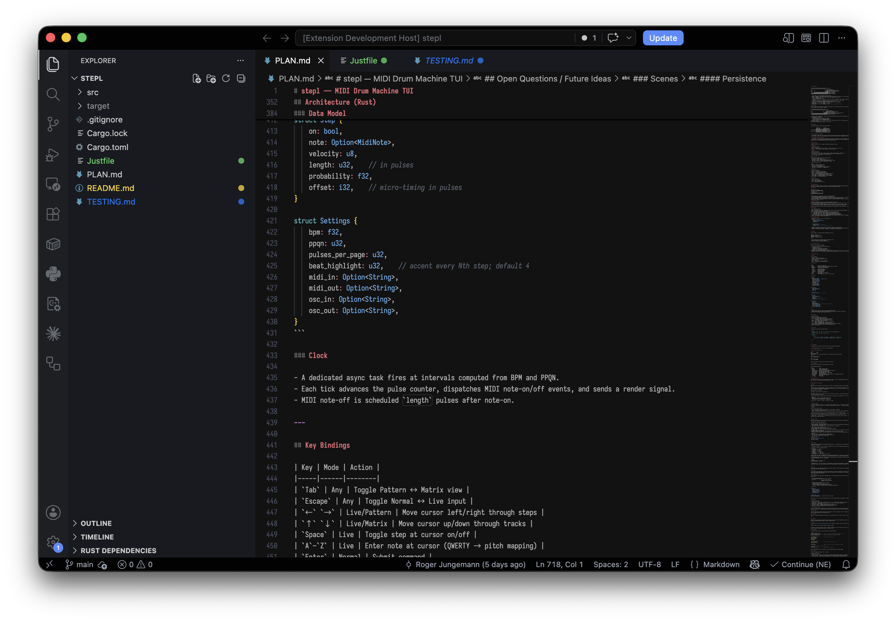

# VS Code Folder Labels

A VS Code extension that displays macOS Finder color labels as colored badges in the Explorer sidebar. You can also assign or clear labels from the Command Palette or via right-click context menu.

## Features

- **Display Finder Labels**: Shows colored badge dots next to files and folders in the VS Code Explorer that have macOS Finder color labels applied.
- **Set Labels**: Assign any of the 7 standard Finder label colors (Gray, Green, Purple, Blue, Yellow, Red, Orange) to files or folders.
- **Clear Labels**: Remove Finder labels from files or folders.
- **Context Menu Integration**: Right-click on any file or folder in the Explorer to set or clear labels.
- **Command Palette**: Use `Set Finder Label...` and `Clear Finder Label` commands from the Command Palette.
- **Live Updates**: Automatically refreshes when labels are changed externally (e.g., in Finder).
- **Configurable**: Toggle visibility for files and folders separately.

## Screenshot



The extension displays colored `●` badges next to files and folders that have Finder labels. Each color corresponds to the standard macOS Finder label colors.

## Requirements

- **macOS only**: This extension only works on macOS due to its reliance on Finder's extended attributes.
- **`tag` CLI tool (recommended)**: For best performance, install the `tag` CLI tool via Homebrew: `brew install tag`. The extension will fall back to using `xattr` if `tag` is not available.

## Extension Settings

This extension contributes the following settings:

- `folderLabels.enabled`: Enable or disable the extension (default: `true`)
- `folderLabels.showOnFiles`: Show labels on files in the Explorer (default: `true`)
- `folderLabels.showOnFolders`: Show labels on folders in the Explorer (default: `true`)

## Usage

### Set a Label

1. Right-click on a file or folder in the Explorer
2. Select "Set Finder Label..." from the context menu
3. Choose a color from the picker

Or:

1. Open the Command Palette (`Cmd+Shift+P`)
2. Type "Set Finder Label"
3. Select the command and choose a color

### Clear a Label

1. Right-click on a file or folder in the Explorer
2. Select "Clear Finder Label" from the context menu

Or:

1. Open the Command Palette (`Cmd+Shift+P`)
2. Type "Clear Finder Label"
3. Select the command

## How It Works

macOS stores Finder labels as extended attributes (`com.apple.metadata:_kMDItemUserTags`) on files. This extension reads these attributes and displays them as colored badge dots next to filenames in VS Code's Explorer sidebar.

The 7 standard Finder label colors are mapped to the following color indices:

| Color  | Index |
|--------|-------|
| None   | 0     |
| Gray   | 1     |
| Green  | 2     |
| Purple | 3     |
| Blue   | 4     |
| Yellow | 5     |
| Red    | 6     |
| Orange | 7     |

## Architecture

### Reading Labels (Three-Layer Fallback)

The extension uses a three-layer architecture to read Finder labels with graceful degradation:

1. **Layer 1 – Native Extended Attributes** (Recommended)
   - Reads directly from `com.apple.metadata:_kMDItemUserTags` extended attribute using Node's `xattr` command-line tool
   - Parses binary plist format (bplist00) using a built-in TypeScript parser
   - Supports both standard plist format (with offset tables) and Finder's minimal inline format
   - Fastest and most reliable path

2. **Layer 2 – `tag` CLI Tool** (Optional fallback)
   - Uses the Homebrew `tag` CLI tool if xattr is unavailable
   - Parses `tag --list` output to extract color information
   - Slower than native xattr but provides compatibility on systems without xattr

3. **Layer 3 – Graceful Degradation**
   - If both previous layers fail, the extension continues running without errors
   - No labels displayed but the extension doesn't crash or impair VS Code

### Writing and Clearing Labels

Setting labels uses the best available method:
- **Preferred**: Write directly via xattr with properly formatted binary plist
- **Fallback**: Use the `tag` CLI tool to set labels
- Both methods preserve existing non-color tags on files

### Performance Optimizations

- **Caching**: Labels are cached for 5 seconds per file to minimize filesystem calls
- **Pending Deduplication**: Multiple concurrent requests for the same file are batched into a single read
- **Selective Preloading**: The extension preloads visible files when the Explorer loads to provide immediate feedback
- **File System Watcher**: External changes to extended attributes are detected and refresh the display

### Binary Plist Parsing

The extension includes a complete TypeScript-based binary plist parser (`src/bplist.ts`) that:
- Parses both standard and minimal plist formats
- Handles inline object references for Finder's compressed format
- Builds valid binary plist output when writing labels
- Requires no external dependencies or subprocess calls

## Limitations

- **Performance**: Reading extended attributes for each file can be slow, especially in large directories. The extension uses caching to minimize this impact.
- **Permissions**: Files protected by System Integrity Protection (SIP) or in restricted directories may not have their labels readable/writable.
- **Non-macOS Platforms**: This extension is macOS-only and will not activate on other platforms.

## Development

### Prerequisites

- Node.js 18+
- VS Code 1.75+
- macOS (the extension does not activate on other platforms)
- Recommended: `brew install tag` for the full xattr read/write path during testing

### Setup

```bash
git clone https://github.com/rjungemann/vscode-folder-labels
cd vscode-folder-labels
npm install
npm run compile
```

### Running in the Extension Development Host

The fastest way to test changes interactively:

1. Open this repository folder in VS Code.
2. Press **F5** (or run **Run Extension** from the Run & Debug panel).
3. A new **Extension Development Host** window opens with the extension loaded.
4. In that window, open any folder that contains files with macOS Finder labels.
5. Colored `●` badges should appear next to labelled files in the Explorer sidebar.

The launch config (`Run Extension` in [.vscode/launch.json](.vscode/launch.json)) starts `npm: watch` as a pre-launch task so TypeScript recompiles automatically on save — you only need to reload the Host window (`Cmd+R`) to pick up changes.

### Applying a test label from the terminal

If you don't have Finder labels set on any files, create some quickly:

```bash
# With the tag CLI (brew install tag)
tag --add Red /path/to/some/file.txt
tag --add Green /path/to/some/folder

# Without tag — write directly via xattr + plutil
printf 'bplist00\xa1\x01\x5dRed\x5c\x0a\x36\x08\x0a\x00\x00\x00\x00\x00\x00\x01\x01\x00\x00\x00\x00\x00\x00\x00\x02\x00\x00\x00\x00\x00\x00\x00\x00\x00\x00\x00\x00\x00\x00\x00\x10' \
  | xattr -w com.apple.metadata:_kMDItemUserTags - /path/to/some/file.txt
# Easier: just label it in Finder (right-click → Tags)
```

### Verifying label reads from the command line

```bash
# Read raw attribute
xattr -p com.apple.metadata:_kMDItemUserTags /path/to/file.txt | plutil -convert json - -o -

# With tag CLI
tag --list /path/to/file.txt
```

### Watch mode

Keep `tsc` running in the background while you edit:

```bash
npm run watch
```

Then changes compile automatically — just reload the Host window after each save.

### Inspecting extension output

In the Extension Development Host window, open **Output** (`Cmd+Shift+U`) and select **Folder Labels** from the dropdown to see `console.log` / `console.debug` output from the extension.

### Linting

```bash
npm run lint
```

## Status

✅ **All core features are implemented and working:**
- ✅ Display Finder labels as colored badges in VS Code Explorer
- ✅ Set labels via context menu or Command Palette with color picker
- ✅ Clear labels via context menu or Command Palette
- ✅ Live updates when external label changes are detected
- ✅ Configuration support for files and folders visibility
- ✅ Three-layer fallback architecture (native xattr → tag CLI → graceful degradation)
- ✅ TypeScript binary plist parser supporting both standard and minimal formats
- ✅ Comprehensive caching and performance optimizations
- ✅ Clean TypeScript compilation (zero errors/warnings)

## Release Notes

### 0.1.0

Initial release of Folder Labels extension.

- Display Finder labels as colored badges in Explorer
- Set and clear labels via context menu or Command Palette
- Live updates when labels change externally
- Configurable visibility for files and folders

---

**Enjoy!**
